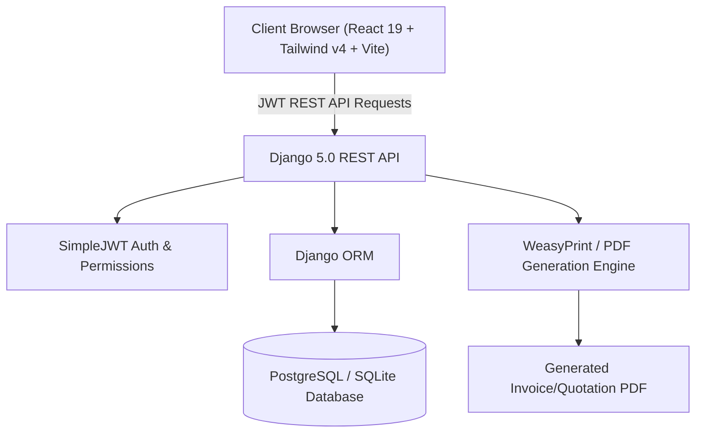

# Invoicify — Business Document Management System

<div align="center">

[](https://github.com/Janani-V219/business-document-management-system/actions/workflows/deploy.yml)
[](https://react.dev/)
[](https://www.djangoproject.com/)
[](https://vite.dev/)
[](https://tailwindcss.com/)
[](LICENSE)

**An enterprise-grade, full-stack Quotation & Invoice Management System featuring automated sequential numbering, customizable visual document templates, client/product directories, PDF generation, and real-time financial intelligence.**

### 🌐 [Click Here for Live Demo](https://Janani-V219.github.io/business-document-management-system/)

</div>

---

## ⚡ Quick Demo Access

You can explore the interactive live demo immediately without setting up a local database:

| Role | Username | Password | Access Level |
| :--- | :--- | :--- | :--- |
| **Admin** | `admin` | `admin123` | Full access (Users, Company Settings, Numbering, Documents) |
| **Staff** | `staff` | `staff123` | Document creation, Client & Product management |

---

## 🚀 Key Features

- 📑 **Quotation & Invoice Lifecycle**: Effortlessly draft, review, accept, and convert quotations into official invoices with 1-click conversion.
- 🔢 **Custom Numbering Engine**: Configurable prefix, separator, year/date patterns, and sequence padding (e.g. `QT-2026-0001`, `INV-2026-0001`).
- 🎨 **Visual Template Designer**: Integrated document template customization with live preview and customizable layouts powered by GrapesJS.
- 📄 **PDF & Print Ready**: Server-side and browser-ready PDF rendering for official client transmission and downloads.
- 👥 **Clients & Products Directory**: Comprehensive records with custom tax rates, currencies, billing addresses, and payment terms.
- 📊 **Executive Dashboard**: Real-time business metrics, revenue summaries, pending approvals, and document activity streams.
- 🔐 **Role-Based Access Control**: Secure JWT authentication with granular permissions for administrators and staff members.
- 🌐 **Offline / Demo Resilience**: Built-in fallback demo engine allowing seamless evaluation and test flows on static deployments like GitHub Pages.

---

## 🏗️ Architecture



---

## 💻 Tech Stack

### Frontend
- **Framework**: React 19 with Vite 8
- **Styling**: Tailwind CSS v4, Lucide React icons
- **Document Editor**: GrapesJS visual designer
- **Routing & State**: React Router v7, React Context API
- **HTTP Client**: Axios with interceptors and intelligent offline/mock fallback

### Backend
- **Framework**: Django 5 & Django REST Framework (DRF)
- **Authentication**: `djangorestframework-simplejwt`
- **Database**: PostgreSQL (Production) / SQLite (Graceful local fallback)
- **PDF Engine**: WeasyPrint & Pillow
- **CORS**: `django-cors-headers`

---

## 🛠️ Local Development Setup

### 1. Prerequisites
- Python 3.10+
- Node.js 18+ and npm
- Git

### 2. Clone Repository
```bash
git clone https://github.com/Janani-V219/business-document-management-system.git
cd business-document-management-system
```

### 3. Backend Setup
```bash
# Navigate to backend folder
cd backend

# Create and activate virtual environment
python -m venv venv
# On Windows:
.\venv\Scripts\activate
# On macOS/Linux:
source venv/bin/activate

# Install dependencies
pip install -r requirements.txt

# Configure environment variables
cp .env.example .env

# Run database migrations
python manage.py migrate

# (Optional) Create superuser
python manage.py createsuperuser

# Start development server
python manage.py runserver
```
The Django API will be running at `http://127.0.0.1:8000/`.

### 4. Frontend Setup
In a new terminal window:
```bash
# Navigate to frontend folder
cd frontend

# Install dependencies
npm install

# Start Vite dev server
npm run dev
```
The frontend application will be running at `http://localhost:5173/`.

---

## 📋 API Endpoints Overview

| Endpoint | Methods | Description |
| :--- | :--- | :--- |
| `/api/auth/login/` | `POST` | Authenticate user & obtain JWT tokens |
| `/api/auth/refresh/` | `POST` | Refresh expired access token |
| `/api/auth/me/` | `GET` | Get authenticated user profile |
| `/api/dashboard/` | `GET` | Fetch business metrics & recent activity |
| `/api/clients/` | `GET`, `POST` | List and create client records |
| `/api/products/` | `GET`, `POST` | List and create products/services |
| `/api/quotations/` | `GET`, `POST` | Manage quotations |
| `/api/quotations/{id}/convert-to-invoice/` | `POST` | 1-Click convert quotation to invoice |
| `/api/invoices/` | `GET`, `POST` | Manage invoices and payment states |
| `/api/templates/` | `GET`, `POST`, `PUT` | Manage custom document layouts |
| `/api/settings/numbering/` | `GET`, `PUT` | Configure document numbering patterns |
| `/api/company/` | `GET`, `PUT` | Update company profile and branding |

---

## 🚀 Deployment

### GitHub Pages (Frontend)
Automated continuous deployment is configured using GitHub Actions (`.github/workflows/deploy.yml`). Any push to the `main` branch automatically builds and publishes the latest application to GitHub Pages.

### Backend Deployment (Render / Railway / Docker)
The backend is production-ready for deployment on Render, Railway, or any Linux VPS:
1. Set `DEBUG=False` in `.env`.
2. Configure `DATABASE_URL` for PostgreSQL.
3. Configure `ALLOWED_HOSTS` and `CORS_ALLOWED_ORIGINS`.
4. Run `python manage.py collectstatic`.

---

## 📄 License

This project is licensed under the [MIT License](LICENSE).
